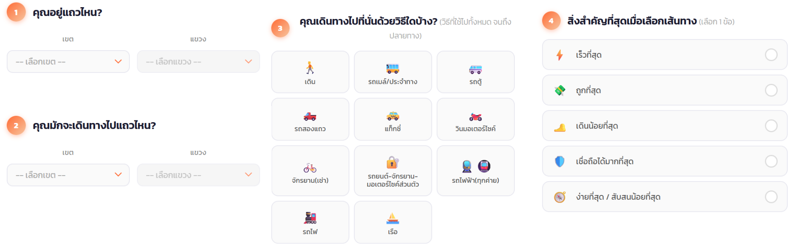

## HCI Transportation Survey 🗺️

เพื่อรวบรวมข้อมูลรูปแบบและพฤติกรรมการเดินทางของประชากรในเขตพื้นที่กรุงเทพ นำมาใช้เป็นพื้นฐานในการวิเคราะห์เส้นทางการเดินทาง และประกอบการพัฒนา Web Application สำหรับแนะนำการเดินทางที่เหมาะสม

https://hci-surveyform.vercel.app/

(งานวิจัยนี้เป็นส่วนหนึ่งของรายวิชา 2110583.69 HCI and Generative AI Hands-on Research and Case Studies)

